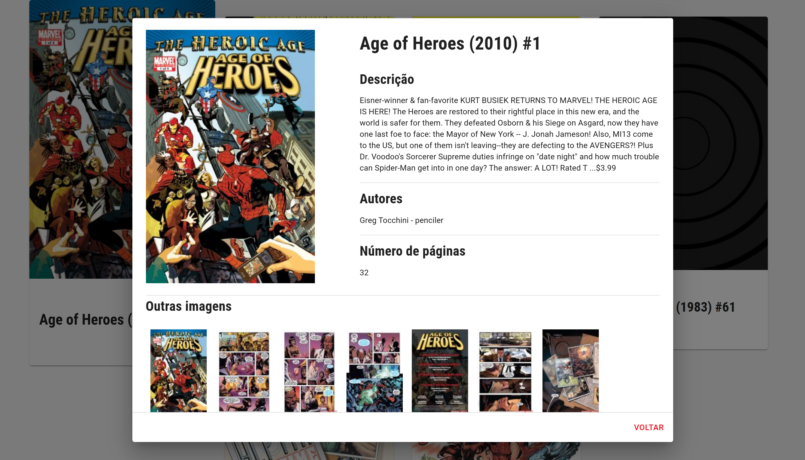
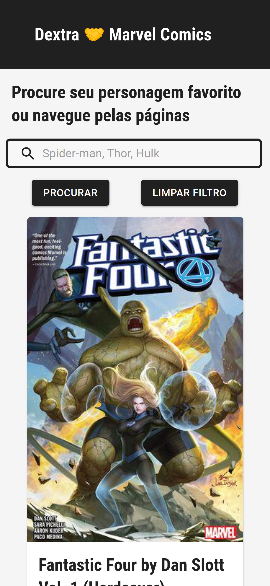
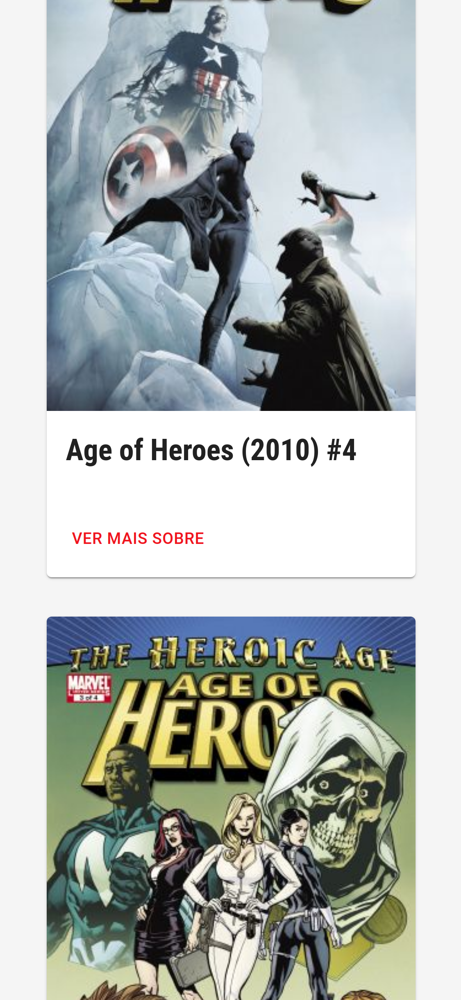
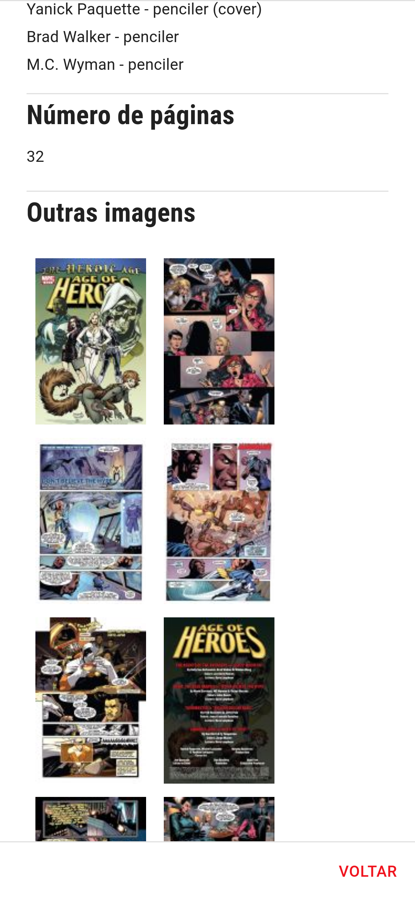
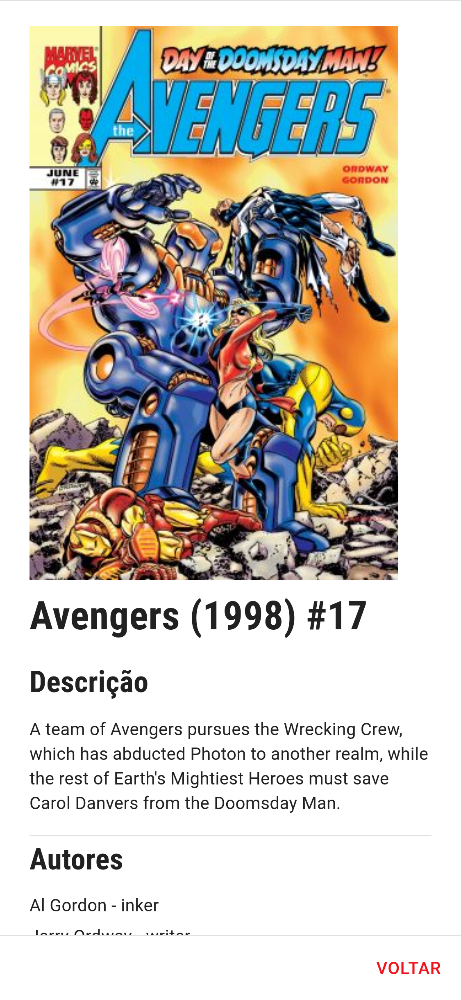

# Challenge Marvel Comic

Você pode testar este projeto em [Marvel Comic App](https://marvelcomics.vercel.app/)

### Preview web




### Preview mobile







## Features

- [x] Listagem dos quadrinhos
- [x] Paginação dos quadrinhos
- [x] Pesquisa por personagem
- [x] Detalhe dos quadrinhos
- [x] Qualidade 
- [x] Criar a aplicação responsiva;
- [x] Hospedar sua aplicação em algum servidor cloud (se o fizer, envie o link da aplicação hospedada junto com o link do repositório);

## Tecnologias utilizadas

- [ReactJS](https://pt-br.reactjs.org/) 
- [Next.JS](https://nextjs.org/)
- [Material-UI](https://material-ui.com/)
- [Typescript](https://www.typescriptlang.org/)
- [ESLint](https://eslint.org/)
- [Prettier](https://prettier.io/)


---

Este projeto utiliza a API da Marvel Comics ([link](https://developer.marvel.com)) caso queire rodar localmente, crie o arquivo `.env.local` e insira suas chaves no arquivo

Exemplo: 
```
REACT_APP_PUBLIC_API_KEY: "SUA_CHAVE_AQUI"
REACT_APP_PRIVATE_API_KEY: "SUA_CHAVE_PRIVADA_AQUI"
```

---